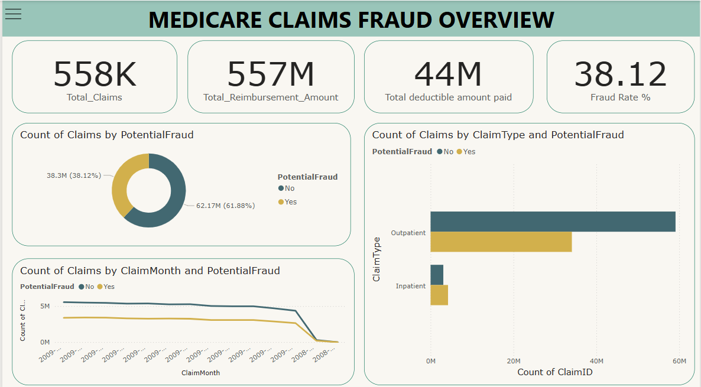
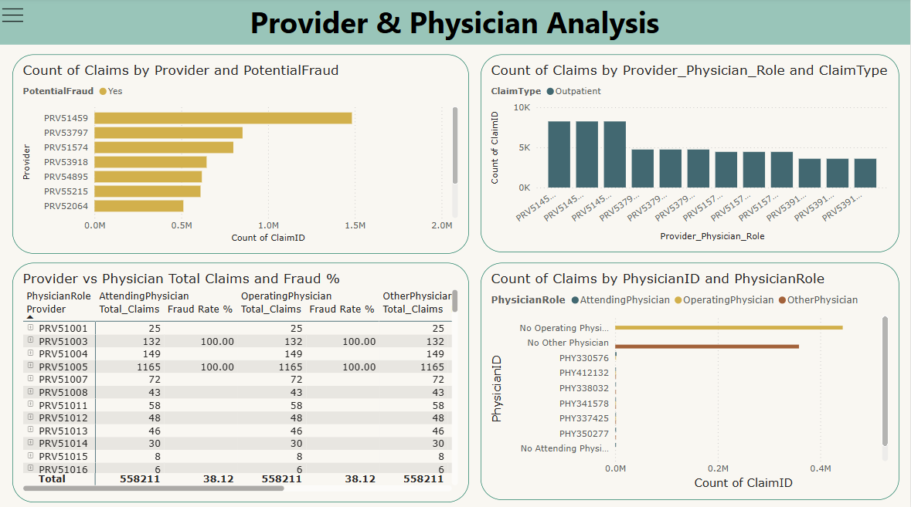
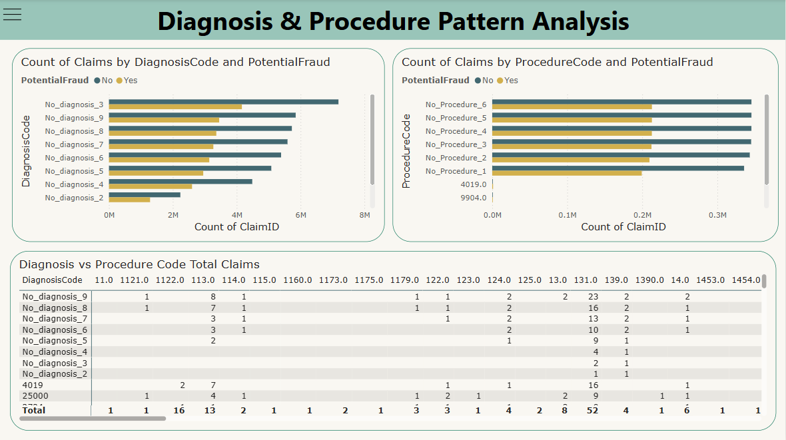
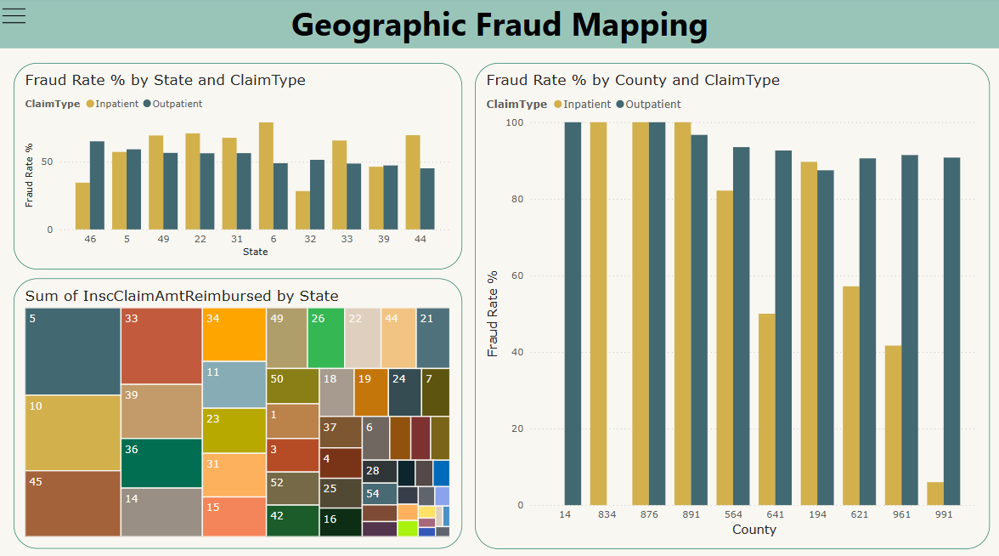
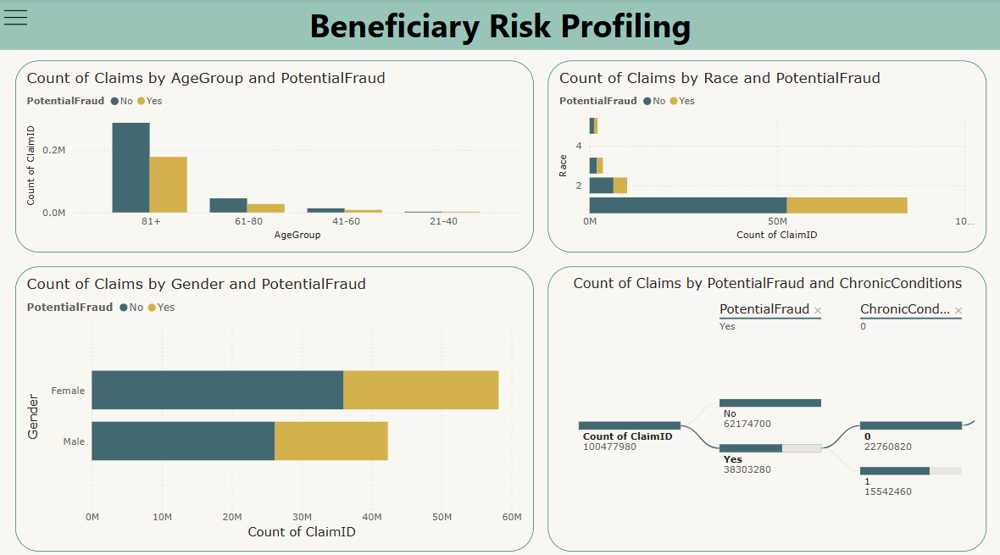

# Medicare Fraud Claims Analysis

## 📑Table of Contents

- [Project Overview](#project-overview)
- [Data Sources](#data-sources)
- [Tools](#tools)
- [Data Cleaning and Preparation](#data-cleaning-and-preparation)
- [Exploratory Data Analysis (EDA)](#exploratory-data-analysis-eda)
- [Power BI Interactive dashboard](#power-bi-interactive-dashboard)
- [Results/Findings](#resultsfindings)
- [Recommendations](#recommendations)

## 📁Project Overview
Medicare fraud costs the U.S. healthcare system billions annually. This project analyzes inpatient and outpatient claims data, along with provider, physician, beneficiary, diagnosis, and procedure details—to identify patterns and anomalies that may indicate fraudulent billing.

## 🌐Data Sources

- <b>Provider:</b> This table captures the information about Providers who gave treatment for the patient as per the claim and details about whether the Provider is involved in fraudulent activities  
- <b>Beneficiary:</b> This table contains detailed information about the Beneficiaries (Patient) who have taken treatment from the provider and their demographic details and Chronic Conditions.  
- <b>Inpatient:</b> This table captures data claims for the patients admitted to the hospital and the diagnosis procedure codes for the claims.  
- <b>Outpatient:</b> This table indicates the details about the claims of patients who visited the hospital and the diagnosis procedure codes for the claims.  

### 💻Tools

- Python - Data cleaning and normalization, Exploratory Data analysis
- Pandas - Data manipulation
- Matplotlib & Seaborn - Data visualization
- Power BI - Creating interactive dashboards and reports

### 🔍Data Cleaning and Preparation

The raw Medicare claims data required extensive preprocessing before analysis. Using Python (Pandas, NumPy), the following steps were performed:

- Handled missing, duplicate, and inconsistent values.
- Converted data types (e.g., date formats, categorical encoding).
- Merged inpatient, outpatient, provider, and beneficiary datasets into a unified structure.
- Generated new features such as claim duration, admission duration, and age.

### ✨🔍Exploratory Data Analysis (EDA)

Conducted in-depth exploratory data analysis to gain insights into Medicare claim behavior and identify potential fraud indicators. The analysis focused on various factors, including: 

- <b>Distribution Analysis of:</b>
  - Fraudulent Claims
  - Fraudulent Claims across inpatient and outpatient claims
  - Insurance amount reimbursed and deductible amount paid in inpatient and outpatient claims
  - Claim duration, Admission duration, Age of Beneficiaries

- <b>Provider based analysis:</b>
  - Top 10 Provider occurring in fraudulent activities in inpatient claims
  - Top 10 Provider occurring in fraudulent activities in outpatient claims
  - Top 10 Provider occurring in fraudulent activities in both inpatient and Outpatient Claims
  - Top 10 Provider and Physician combos in fraudulent claims in inpatient claims and outpatient claims

- <b>Diagnosis Pattern analysis:</b>
  - Top 10 Diagnosis codes used in fraudulent claims in inpatient claims
  - Top 10 Diagnosis codes used in fraudulent claims in outpatient claims

- <b>Procedure code Pattern analysis</b>
  - Top 10 Procedure codes used in fraudulent claims in inpatient claims
  - Top 10 Procedure codes used in fraudulent claims in outpatient claims

  

### 📊Power BI Interactive dashboard

An interactive Power BI dashboard was built to visualize key metrics and uncover potential Medicare fraud patterns.

 
 
 
 
 

   

### 📝Results/Findings

The analysis of Medicare claims data reveals several compelling patterns and anomalies that strongly suggest systemic fraud, especially in outpatient services. The key findings are categorized below:

- <b>Diagnosis and Procedure Code Anomalies:</b>
  - A significant proportion of fraudulent claims, both inpatient and outpatient, contain non-specific placeholder codes (e.g., No_diagnosis_X, No_Procedure_X).
  - Valid ICD codes like 4019 (hypertension) and 25000 (diabetes) are underrepresented in fraudulent claims compared to placeholder codes.
  - Outpatient claims show an extreme dominance of these dummy codes, suggesting automated or templated fraud.

- <b>Diagnosis-Procedure Combinations:</b>
  - Top combinations in fraudulent inpatient claims often pair a valid diagnosis (e.g., 4019) with a placeholder procedure code, which is implausible in medical scenarios.
  - In outpatient claims, fraudulent combinations almost exclusively use No_diagnosis_3 or No_diagnosis_9 with dummy procedures, hinting at deliberate manipulation.

- <b>Demographic Disparities:</b>
  - Fraudulent claims are more frequently associated with beneficiaries coded as Gender 0 (likely females) and Race 1 (typically representing White).
  - Age distribution analysis shows that fraudulent claims are skewed toward older beneficiaries (80+ years), especially in inpatient cases. Outpatient fraud spans a wider 
    age range.

- <b>Chronic Conditions Patterns:</b>
  - Fraud is disproportionately associated with common, high-cost chronic conditions such as Ischemic Heart Disease, Diabetes, and Heart Failure.
  - Many fraudulent claims are tied to patients with multiple chronic conditions, justifying expensive treatments and frequent visits.
  - Surprisingly, outpatient fraud is also prevalent among beneficiaries with no chronic conditions, suggesting fabricated claims for healthy individuals.

- <b>Geographic and Beneficiary-Level Trends:</b>
  - States like 5 and 33 have consistently high fraud rates across multiple country codes, indicating regional fraud clusters.
  - Individual beneficiaries were identified with 20–30+ fraudulent claims, mostly outpatient. Some also had inpatient fraud, implying repeated or organized fraud patterns.

### 📝🚀Recommendations

- <b>Enhance Rule-Based and AI Fraud Detection:</b>
  - Flag any claims using placeholder codes like No_diagnosis_X or No_Procedure_X for immediate audit.
  - Use diagnosis-procedure pairings (e.g., 4019 + No_Procedure_X) as key features in machine learning models.
  - Include complex chronic condition combinations and demographic data in fraud prediction models.

- <b>Tighten Claims Validation:</b>
  - Implement stricter validation rules to reject or review claims with non-specific codes, especially in outpatient services.
  - Require additional documentation or justification for claims involving multiple chronic conditions without corresponding procedure codes.

- <b>Targeted Auditing:</b>
  - Prioritize audits for beneficiaries with unusually high counts of outpatient claims, states with high fraud incidence (e.g., States 5 and 33), and claims involving 
    gender/race patterns aligned with high-fraud demographics (e.g., Gender 0, Race 1).

- <b>Geospatial and Network Surveillance:</b>
  - Investigate providers and facilities operating in high-fraud regions.
  - Use network analysis to uncover links between providers and beneficiaries involved in repetitive fraudulent activities.

- <b>Policy and Educational Initiatives:</b>
  - Educate providers on proper coding practices and reinforce the risks of submitting placeholder or incomplete information.
  - Promote policies that require at least one valid procedure code in outpatient claims.

- <b>Real-Time Alerts and Feedback:</b>
  - Develop real-time claim monitoring systems to flag suspicious submissions at the point of entry.
  - Implement feedback loops to inform providers of rejected or flagged claims for continuous improvement.
